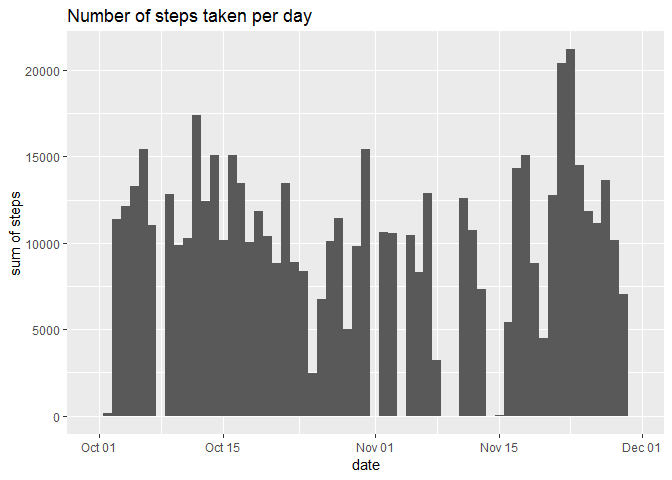
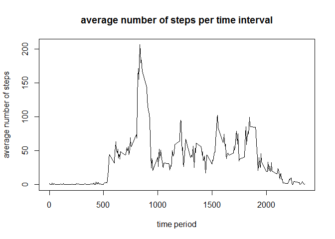
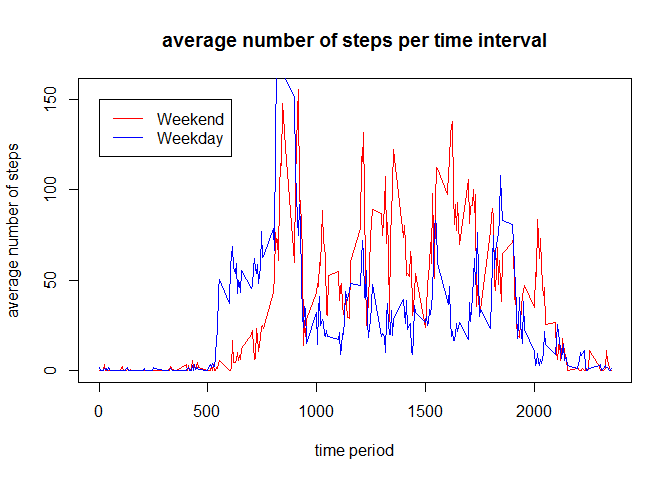

## 1. Loading and preprocessing the data

```r
activity <- read.csv("./data/activity.csv", stringsAsFactors = FALSE)
activity$date <- ymd(activity$date)
activity$wday <- ifelse(wday(activity$date) %in% c(1,7),"weekend","weekday")
```


## What is mean total number of steps taken per day?

### 2. Histogram of the total number of steps taken each day

```r
ggplot(activity) + 
  geom_histogram(aes(x=date, weight=steps), binwidth=1) + 
  ylab("sum of steps") + 
  ggtitle("Number of steps taken per day")
```

<!-- -->


### 3. Mean and median number of steps taken each day

```r
sumStepsPerDay <- aggregate(activity$steps, by=list(Category=activity$date),FUN=sum)


mean(sumStepsPerDay$x, na.rm=TRUE)
```

```
## [1] 10766.19
```

```r
median(sumStepsPerDay$x, na.rm=TRUE)
```

```
## [1] 10765
```

### 4. Average steps per day

```r
avgStepsPerDay <- aggregate(activity$steps, by=list(Category=activity$interval),FUN=mean, na.action=NULL, na.rm=TRUE)
```


## What is the average daily activity pattern?

### 5. Average steps per time interval

```r
plot(avgStepsPerDay, type="l", ylab="average number of steps", xlab="time period", main="average number of steps per time interval")
```

<!-- -->

```r
avgStepsPerDay[which.max(avgStepsPerDay$x),]
```

```
##     Category        x
## 104      835 206.1698
```

## Imputing missing values
### 6. Code to describe and show a strategy for imputing missing data

Count NAs and replace NAs with mean for time interval

```r
sum(is.na(activity$steps))
```

```
## [1] 2304
```

```r
activityNoNa <- ddply(activity,.(interval),transform,steps=ifelse(is.na(steps),median(steps,na.rm=TRUE),steps))

#need to re-sort because it puts the above in the wrong order
activityNoNa <- activityNoNa[order(activityNoNa$date,activityNoNa$interval),]

#let's prove that there are no NAs
sum(is.na(activityNoNa$steps))
```

```
## [1] 0
```


### 7. Histogram of the total number of steps taken each day after missing values are imputed


```r
ggplot(activityNoNa) + 
  geom_histogram(aes(x=date, weight=steps), binwidth=1) + 
  ylab("sum of steps") + 
  ggtitle("Number of steps taken per day - NAs removed")
```

<!-- -->


### Mean and Median comparison between NAs and no NAs

```r
sumStepsPerDayNoNa <- aggregate(activityNoNa$steps, by=list(Category=activityNoNa$date),FUN=sum)

# mean steps per day with NAs
mean(sumStepsPerDay$x, na.rm=TRUE)
```

```
## [1] 10766.19
```

```r
# mean steps per day without NAs
mean(sumStepsPerDayNoNa$x, na.rm=TRUE)
```

```
## [1] 9503.869
```

```r
# median steps per day with NAs
median(sumStepsPerDay$x, na.rm=TRUE)
```

```
## [1] 10765
```

```r
# median steps per day with NAs removed
median(sumStepsPerDayNoNa$x, na.rm=TRUE)
```

```
## [1] 10395
```


## Are there differences in activity patterns between weekdays and weekends?


### 8. Panel plot comparing the average number of steps taken per 5-minute interval across weekdays and weekends
**NOTE:** I am overlaying weekend and weekday on the same chart as I believe it is easier to compare two lines on the same chart instead of two separate charts -  one above the other.

```r
activityNoNa$wday <- as.factor(ifelse(wday(activityNoNa$date) %in% c(1,7),"weekend","weekday"))
activityNoNaWeekday <- filter(activityNoNa, wday=="weekday")
activityNoNaWeekend <- filter(activityNoNa, wday=="weekend")

avgStepsPerDayWeekday <-  aggregate(activityNoNaWeekday$steps, by=list(Category=activityNoNaWeekday$interval),FUN=mean, na.action=NULL, na.rm=TRUE)

avgStepsPerDayWeekend <-  aggregate(activityNoNaWeekend$steps, by=list(Category=activityNoNaWeekend$interval),FUN=mean, na.action=NULL, na.rm=TRUE)

plot(avgStepsPerDayWeekend, type="l", ylab="average number of steps", xlab="time period", main="average number of steps per time interval", col="red")
lines(avgStepsPerDayWeekday, col="blue")
legend(1,150,legend=c("Weekend","Weekday"),col=c("red","blue"), lty=1)
```

<!-- -->


**NOTE:** I am overlaying weekend and weekday on the same chart as I believe it is easier to compare two lines on the same chart instead of two separate charts -  one above the other.
